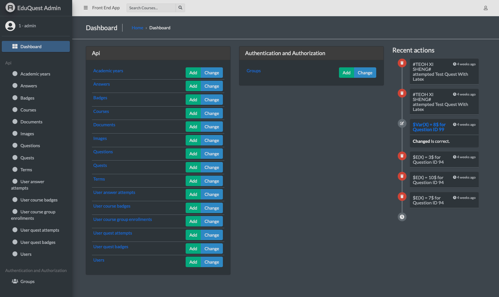
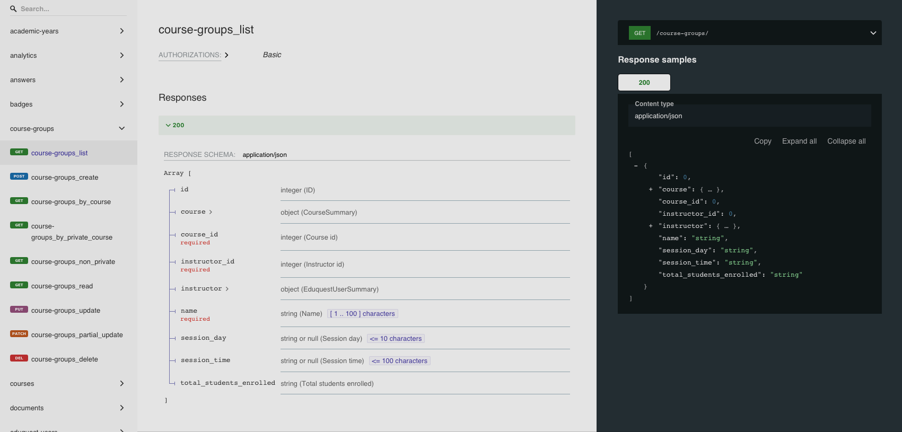

# EduQuest Backend (Django)


## Overview
EduQuest Backend Django is a backend application built with Django for managing educational quests, courses, and user enrollments.
The frontend application can be found [here](https://github.com/xeroxis-xs/EduQuest-Frontend-ReactJS).

## Table of Contents
- [Admin Panel](#admin-panel)
- [API Documentation](#api-documentation)
- [Technologies](#technologies)
- [Features](#features)
- [Requirements](#requirements)
- [Installation and Running the Application](#installation-and-running-the-application)
- [Running Tests](#running-tests)

## Admin Panel


## API Documentation
The API documentation can be found [here](https://eduquest-admin.azurewebsites.net/docs/)


## Technologies
- Django
- Django REST Framework
- PostgreSQL
- Redis
- Celery
- Azure Blob Storage
- Azure Active Directory
- Docker
- Pytest
- Flake8

## Features
- Authentication with JWT
- User management
- Course and group management
- Quest and question management
- Badge management
- Asynchronous task processing with Celery and Redis

## Requirements
- Recommended IDE: JetBrains PyCharm
- Python 3.10
- PostgreSQL
- Redis

## Installation and Running the Application

1. **Clone the repository:**
    ```bash
    git clone https://github.com/xeroxis-xs/EduQuest-Backend-Django.git
    cd EduQuest-Backend-Django
    ```

2. **Create and activate a virtual environment:**
    ```bash
    python -m venv venv
    source venv/bin/activate
    ```

3. **Install dependencies:**
    ```bash
    pip install -r requirements.txt
    ```

4. **Set up environment variables:**
    Create a `.env` file in the root directory and add the following:
    ```env
    SECRET_KEY=your_django_secret_key
    ALLOWED_HOSTS=your_allowed_hosts_ip
    DB_NAME=postgres_sql_db_name
    DB_USER=postgres_sql_db_user
    DB_PASSWORD=postgres_sql_db_password
    DB_HOST=postgres_sql_db_host
    DB_PORT=postgres_sql_db_port
    AZURE_AD_CLIENT_ID=your_registered_backend_app_client_id
    AZURE_AD_CLIENT_SECRET=your_registered_backend_app_client_secret
    AZURE_ACCOUNT_NAME=your_azure_storage_account_name
    AZURE_ACCOUNT_KEY=your_azure_storage_account_key
    AZURE_STORAGE_ACCOUNT_CONNECTION_STRING=your_azure_storage_account_connection_string
    AZURE_CONTAINER=your_azure_storage_container
    DEBUG=1_for_dev_0_for_prod
    ```

5. **Change Directory to the project root:**
    ```bash
    cd app
   ```

6. **Apply migrations for new database:**
    ```bash
    python manage.py migrate
    ```

7. **Create a superuser:**
    ```bash
    python manage.py createsuperuser
    ```

8. **Run the development server without Redis and Celery:**
    ```bash
    python manage.py runserver
    ```

9. **Run the development server with Redis and Celery:**
    ```bash
   docker-compose up -d
   ```

## Running Tests
To run all unit tests, use the following command:
```bash
python manage.py test api.tests
```